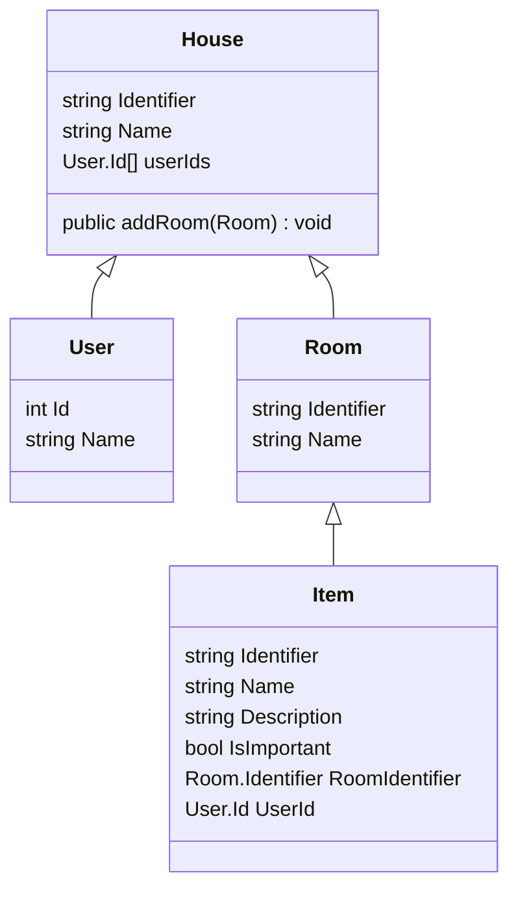

# このリポジトリについて

資材管理アプリケーションの作成を通じてクリーンアーキテクチャーを学んでもらう為の教材として用意したものです。
デスクや炊飯器やゲーム機などの資材が家のどの部屋にあるのかを管理するアプリケーションです。

# 環境の用意

### 0からの場合

1. Docker環境インストール
1. Laravel install
   ```
   curl -s https://laravel.build/skillup-zaikan?with=pgsql|bash`
   ```
1. 起動
    ```
    ./vendor/bin/sail up -d
    ```
1. バージョン確認
    ```
    $ ./vendor/bin/sail exec laravel.test php artisan tinker -V
    Laravel Framework 11.21.0
    ```
1. デバッグ関連
    ```bash
    ./vendor/bin/sail artisan sail:publish
   
    # php.iniの変更
    docker/8.3/php.ini
    ```

### 1からの場合

1. git clone [this repository]
   1composer install
    ```shell
    docker run --rm -it -v $PWD:/app -u `id -u`:`id -g` composer composer
    ```
1. 起動
    ```
    ./vendor/bin/sail up -d
    ```

# 前提

- 資材は必ず家の中にあるxw
- 家の内部は仕切られていて必ず部屋/トイレ/廊下などの名称がある
- つまり、資材は必ずどこかの部屋にある
- 資材の所有者ひとりまたは不特定
- 家以外の環境は考慮しない

# 実装手順

1. エンティティ、ドメインバリデーションを考える
1. ユースーケース、ユースケースのI/Oを考える
1. 永続化を検討する
1. プレゼンテーション層（I/O、腐敗防止層）を考える

ドメインエキスパートとの距離が近い場合は1から実施、コンテキストを適切に切る
遠い場合は2を先に実施、コンテキストは推測の範囲で適当に切る

# 重要な事

- ドメインやアプリケーションに関係しない事柄を考えてはいけない
  - 遅延評価etc
    - その手のパフォーマンスはドメインには関係ない、後で考慮するのは構わない
  - メモリの使用量を気にする
    - クリーンアーキテクチャーやめろ
      - ドメイン層を用いなければ良いが、その場合クリーンアーキテクチャーを用いるメリットも薄い
  - 実行速度を気にする
    - クリーンアーキテクチャーやめろ、使用言語変えろ
  - データベースのパフォーマンス
    - DB都合でエンティティを単発で扱うかリストで扱うかはドメインに関係ない

# エンティティ



# ディレクトリ構成

```shell
./packages/
└── ZaikoKanri
    ├── Application
    │   └── UseCase
    │       ├── House
    │       │   ├── Create
    │       │   └── List
    │       ├── Item
    │       │   └── Create
    │       └── Room
    │           ├── Create
    │           └── List
    ├── Domain
    │   ├── Entity
    │   ├── Repository
    │   └── Value
    ├── Infrastructure
    │   └── Repository
    └── UserInterface
```

# テストユーザー作成

1. 作成
    ```
    $ ./vendor/bin/sail artisan migrate
    $ ./vendor/bin/sail tinker
    > $user = new App\Models\User()
    > $user->name = 'test';
    > $user->email = 'test@example.com';
    > $user->email_verified_at = now();
    > $user->password = Hash::make('password')
    > $user->save()
    ```
1. 確認
    ```
    laravel=# select * from users;
    id | name |      email       |  email_verified_at  |                           password                           | remember_token |     created_at      |     updated_at
    ----+------+------------------+---------------------+--------------------------------------------------------------+----------------+---------------------+---------------------
    1 | test | test@example.com | 2024-09-01 06:50:59 | $2y$12$MTedj84bRajcMljPRGwJM.HFZ9q3ltlePmJNzC3vcdeEhHkKduXJK |                | 2024-09-01 06:52:02 | 2024-09-01 06:52:02
    ```
1. ログイン確認
    ```
    $ ./vendor/bin/sail tinker
    > Auth::loginUsingId(1)
    ```
